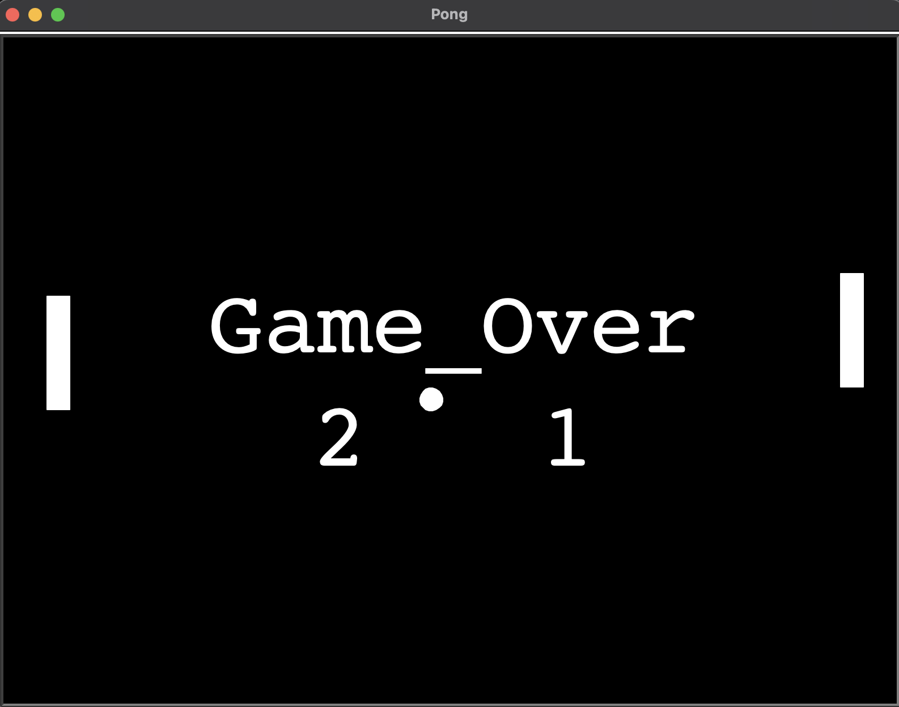

# Simple Pong Game

A simple implementation of the classic Pong game using Python and the Turtle graphics library.



## Features
- Basic paddle and ball collision mechanics.
- Score tracking for both players.
- Simple user interface and controls using arrow keys.
- Leveling system

## Prerequisites

- Python 3 installed on your system.

## Installation

1. Clone the repository:

```bash
git clone https://github.com/hasanforaty/Pong_game.git
```
